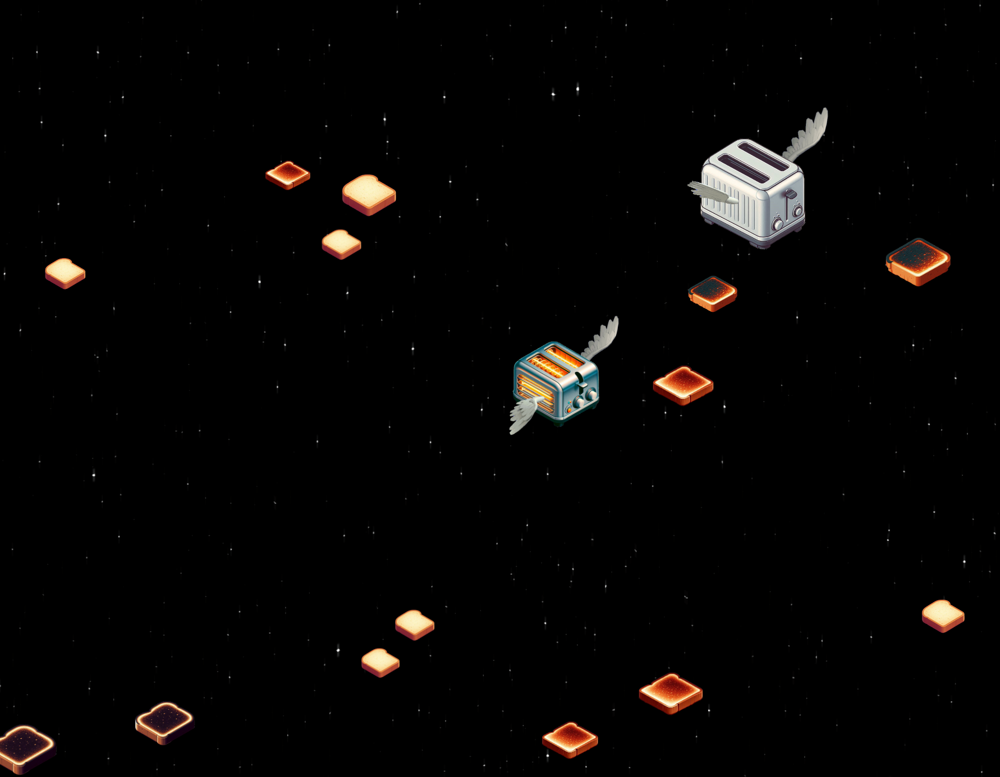

# ✈️🥖 **Flight of the Toasters** 🥳🎉

This started out as a "simple" project to create a fun way to display the health of my homelab server. 🏡💻 I ended up spending so much time on the looks of it that I decided to make a generic version. 🎨✨ One that didn't rely on inputs from a server and could be used by anyone. 🙌 So here we are. The flying toasters are back! 🚀🍞

Here's the demos (Don't forget to click UnMute on the page! 🔊):
- https://flyingk8s.milagrofrost.com/
  - My homelab server health depicted by flying toasters. 🏡💻
- https://flyingk8s.milagrofrost.com/?configFile=smaller
  - More traditional flying toasters. 🍞🕊️
- https://flyingk8s.milagrofrost.com/?configFile=mayhem
  - These guys need to tone down their caffeine intake. ☕🍞🕊️
- https://flyingk8s.milagrofrost.com/?configFile=policestate
  - If every one is a cop, then no one is a cop. 🚓🍞🕊️
- http://localhost:3000/?configFile=christmas
  - Christmas mode with snowfall, festive gifs, no labels, and no police sounds! ❄️🎄

## ✨ **Features** ✨

- 🧭 **Taking a new direction.**
  - Yes, the OG flying toasters are from right to left. 🕰️➡️ These ones are going from left to right. ⬅️⏳ I was already more than halfway through working on animations and images when I realized that I was going the wrong way. 🔄 Or is it? 🤔 Maybe you're crazy and I'm not. 🤪 You need to get yourself checked out. 🏥🩺
- 🚔 **Cops and robbers**
  - Some of these toasts are zooming by faster than others. 🏎️💨 And some are smuggling large portions of butter. 🧈😱 The Butter Police 🚨🧑‍✈️ are on the lookout for these toasts. They will chase them down and take them out. 🚓💥 The Butter Police are not to be trifled with. 😤👊
  - 👮‍♂️🔊 Cops have audio if you choose to unmute the page. 🎧 Are these audio clips from Road Rash 64? 🏍️🎶 Could be.
  - 🔎 You might hear the audio sometimes but not see the cop. That's because the cop is off-screen. 📡🚫 Or they're cop ninjas. 🥷🚓 Something like that.
  - Lore? https://flyingk8s.milagrofrost.com/cops_and_robbers.mp3
- 🍞 **Toast levels**
  - The toasts have 4 levels of toast. 🔢 None, just right, crispy, and burnt. 🔥 AI images. 🖼️🤖
- 🔥 **Toaster levels**
  - The toasters have 4 levels of toasting. 🔢 Off, warm, hot, and on fire. 🔥🔥
- 📏 **Toast and toaster sizes may vary**
  - Add some variety to the toasts and toasters. 📐🎨 
- 👼 **Biblically accurate wings**
  - Do the wings look silly? 😂 Yes, but that's what God intended. 🙏 Even their "odd" flapping patterns are actually totally normal. 🕊️ I'm not sure what you're talking about. 🤷‍♂️
- 💤 **Some toasts pause in the middle of the screen**
  - They're just taking a break. 🛌 They'll get back to flying soon enough. 🕺 Totally meant to do that. 😏
- 🖥️ **Built for large resolution screens**
  - The toasts are flying in 4K. 🏞️ They're not going to be flying in 1080p. That's for plebs. 😜 You can scale the toast and toaster sizes to your liking by updating the `config.json` file. 🛠️📜
- 🏎️ **The faster they fly, the more likely they will render funny**
  - 🕊️ Wings will be separated from the toasters. 🍞🧈 Butter won't be on the toast.
  - 🏆 Toaster or toasts set too small will also do the same.
- 🌐 **Toasters are generated based on values from a remote data source or using the fallback data source `local-fallback.json`.**
- 🥳 **The first few toasts will not have any butter on them or be police.**
  - It just does that. It's a feature. 😏 We're in the features section BTW.
- ❄️ **Christmas mode**
  - Snowfall effect, festive gifs for toasters and toasts, Santa appears larger and less frequently, no labels or police sounds. 🎄❄️

## 🎮 **Select Modes** 🎮

- You can change how the toasters are generated by adding to the URL of the site:
  - https://URL/?configFile=smaller
- I have several modes you can select from:
  - [arbysconvention](public/configs/arbysconvention.json)
  - [calm](public/configs/calm.json)
  - [christmas](public/configs/christmas.json)
  - [crazytoasters](public/configs/crazytoasters.json)
  - [default](public/configs/default.json)
  - [mayhem](public/configs/mayhem.json)
  - [orderly](public/configs/orderly.json)
  - [policestate](public/configs/policestate.json)
  - [smaller](public/configs/smaller.json)
  - [spreadthewealth](public/configs/spreadthewealth.json)
  - [tiny](public/configs/tiny.json)
  - [warpspeed](public/configs/warpspeed.json)

## 📊 **Observability** 📊

- These toasts and toasters can be generated based on K8s metrics. 📈📊
  - https://github.com/milagrofrost/Flying-K8s
- But it doesn't have to be just K8s metrics. 🤯 
  - As long as you follow the same json schema as seen in [public/local-fallback.json](public/local-fallback.json) and adjust the values in [public/configs/default.json](public/configs/default.json) to what makes sense for what your metric values, the sky's the limit!
- Promo : https://flyingk8s.milagrofrost.com/flyingk8s.mp3

## 🆘 **Need help with** 🆘

- 🧑‍💻 I'm not a React developer. 🤓 ChatGPT did most of the legwork for me. 💪 Plus, I'm a little burnt out. 🥵 So the small fixes are becoming a little more difficult for me to do at the moment. 😓
- 🎯 Getting stuff consistently centered. 🧈🕊️ Butter and wings are a little off sometimes. 🧐 I'm not sure why yet.
- 🤷‍♂️ Wings don't flap in sync. 🕊️🔄
- 🕺 Better wing animation? ✨
- 📚 Better code organization. 🧹 I'm not sure if I'm doing this right. 🤷‍♀️

## 🚀 **Future features?** 🚀

- 🛠️ **Mods!** Changing out the toasters and toasts for other images.
  - 🧱 Minecraft Steves and blocks. 🏗️
  - 🎮 and other pop culture references. 🎥🎵
- 🎨 **Non-AI generated images.** I just wanted to see what it would look like. 🤔 I'm not sure if I like it yet. 🧐
- 📜 **More config files!**

## ⚠️ **Known issues** ⚠️

- 📋 **See features above.** 😅

# How to use

## Working with NPM

How to generate your own version of the project.

In the project directory, you can run:

### `npm start`

Runs the app in the development mode.\
Open [http://localhost:3000](http://localhost:3000) to view it in your browser.

The page will reload when you make changes.\
You may also see any lint errors in the console.

### `npm test`

Launches the test runner in the interactive watch mode.\
See the section about [running tests](https://facebook.github.io/create-react-app/docs/running-tests) for more information.

### `npm run build`

Builds the app for production to the `build` folder.\
It correctly bundles React in production mode and optimizes the build for the best performance.

The build is minified and the filenames include the hashes.\
Your app is ready to be deployed!

See the section about [deployment](https://facebook.github.io/create-react-app/docs/deployment) for more information.
